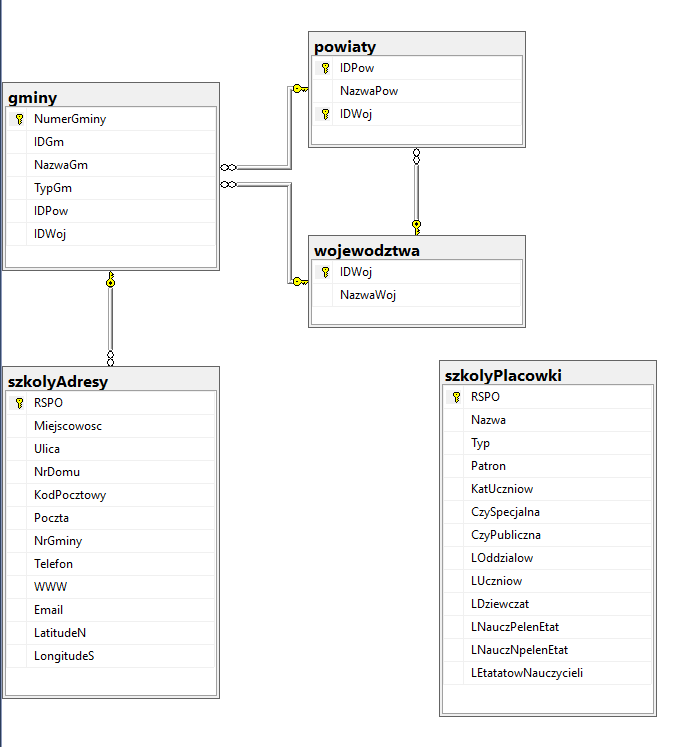

# hackathon
Welcome!
This repo consists of helper files for usage a database in MEGA web-app:
- db_app.py
- db_queries.py
- BetterEducation.bak
There is also dedicated Docker with MS SQL Server of database: [link](https://cloud.docker.com/repository/docker/antyfilidor/hackathon/).

Schema of database is below:




If you use pure docker from MS to add database follow this instruction: [good article on Medium](https://medium.com/@reverentgeek/sql-server-running-on-a-mac-3efafda48861). Here is a resumee:

1. Copy database backup:
```
docker cp BetterEducation.bak sql1:/tmp/BetterEducation.bak
```
2. Restore database system:
```
docker exec sql1 /opt/mssql-tools/bin/sqlcmd -U sa -P P@ssw0rd -Q "RESTORE DATABASE [BetterEducation] FROM DISK='/tmp/BetterEducation.bak' WITH MOVE 'BetterEducation' TO '/var/opt/mssql/data/BetterEducation.mdf', MOVE 'Bettereducation_Log' TO '/var/opt/mssql/data/Betterducation_Log.ldf' "
```
3. Check if everything is ok (after this command a name of already added database should be visible):
```
docker exec sql1 /opt/mssql-tools/bin/sqlcmd -U sa -P P@ssw0rd -Q "SELECT [name] FROM sys.databases"
```

4. Run docker container with database:
```
docker run -d --name h1 -e 'ACCEPT_EULA=Y' -e 'SA_PASSWORD=P@ssw0rd' -p 1433:1433 fde8d2e8f10b
```
